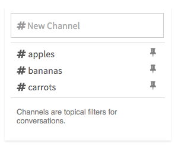

# Channel List

Popup list of discussion channels.



```jsx
import ChannelList from 'patchkit-channel-list'

const channels = [
  { name: 'apples' },
  { name: 'bananas' },
  { name: 'carrots' }
]
const onSelect = c => console.log('selected', c)
<ChannelList channels={channels} onSelect={onSelect} />
```

## Styles

Use the .less file:

```less
@import "node_modules/patchkit-channel-list/styles.less"
```